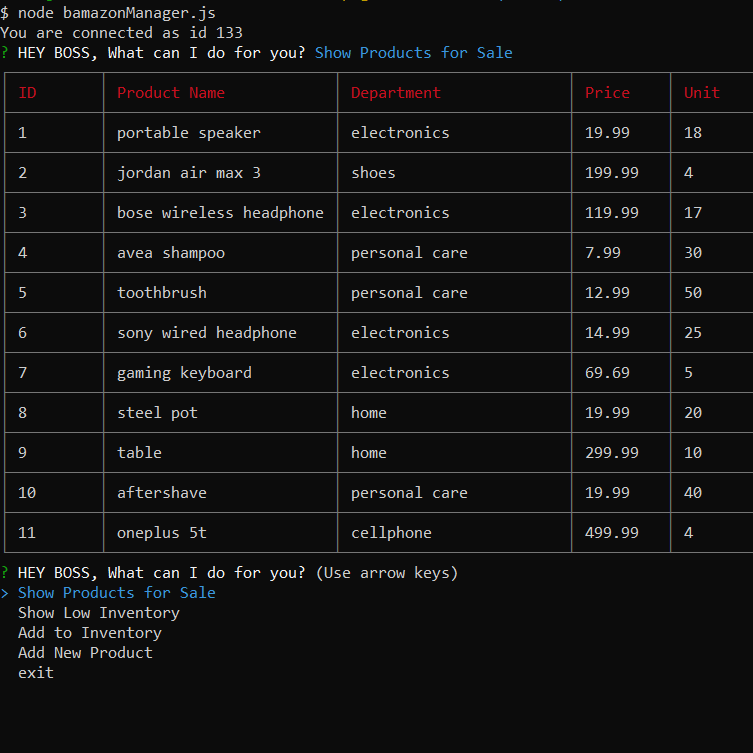
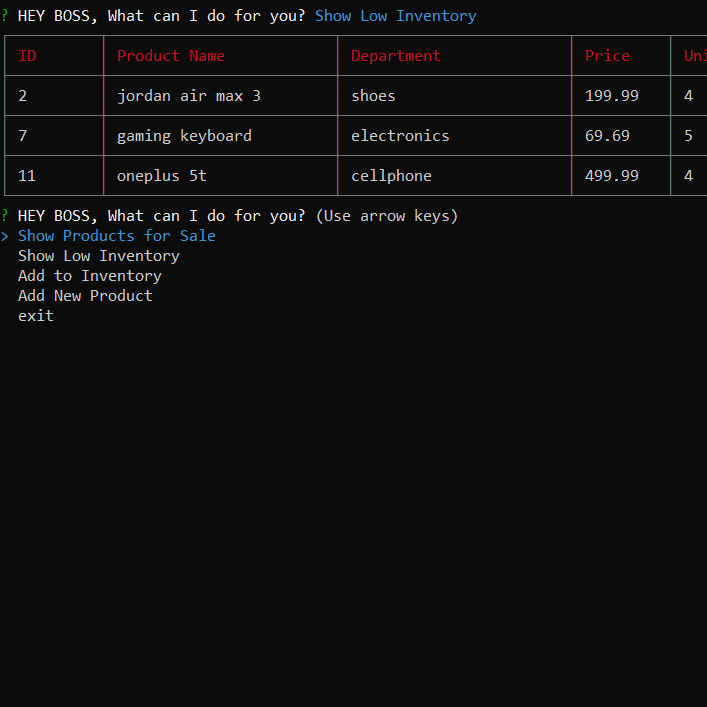
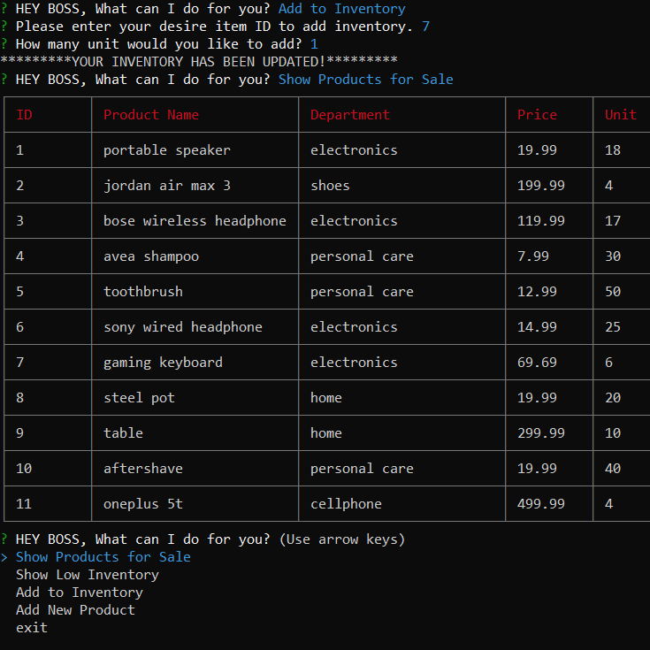
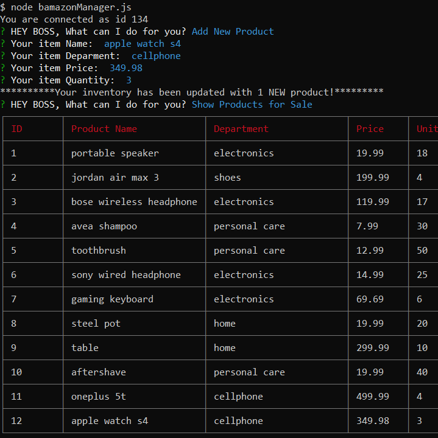

# bAmazon
### bAmazon is a CLI app Amazon-like storefront.
what to do before:
- bAmazon uses MySql, Inquirer and CLI-Table NPM packages.(Make sure you'll install these NPMs)

    - [npm i mysql](https://www.npmjs.com/package/mysql)
    - [npm i inquirer](https://www.npmjs.com/package/inquirer)
    - [npm i cli-table](https://www.npmjs.com/package/cli-table)

## How the bamazonCustomer works?

1 - Running this application will first display all of the items available for sale. Include the ids, names, and prices of products for sale. Then the app will prompt users with two messages. The first will ask for the ID of the product and the second message will ask how many units of the product you would like to buy.

2 - Once you've placed the order, the app will check if the store has enough product in stock to meet your request.

3 - If not, the app will log an insufficient quantity message, and then prevent the order from going through (First pic down below). If the store does have enough of the product, you should fulfill the customer's order. This means updating the SQL database to reflect the remaining quantity. Once the update goes through, the customer will see the total cost of purchase (Second pic down below).

(1st Photo)

(2nd Photo)

## How the bamazonManager works?

The bamazonManager was designed for managers and it contains 4 actions:

### 1- Show Products for Sale: Which shows you all your inventory in a nice chart.

### 2- Show Low Inventory: Which shows you all the items in your inventory that their quantity is equal or lower than 5.

### 3- Add to Inventory: This option will allow you to add quantity to your inventory of the selected item.

### 4- Add New Product: And at last, This option will allow you to add a new item to your inventory.

### For any quastion please email me at: Faran.navazi@gmail.com

FiRi